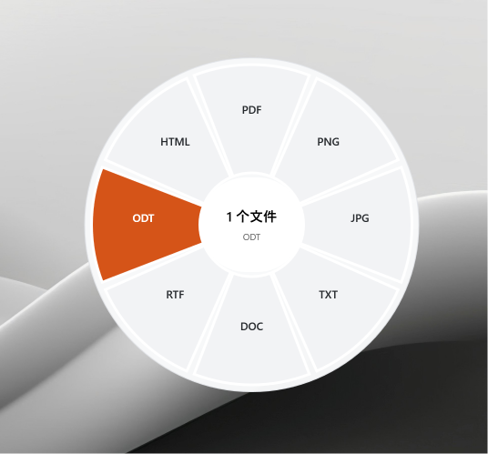
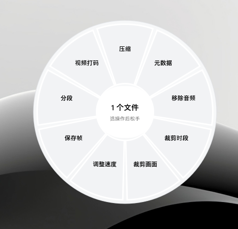
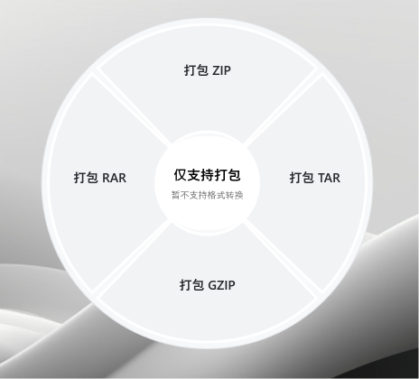
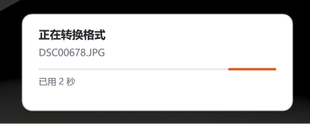

# ZestDrop


**Drag. Drop. Convert.**

A Windows desktop file conversion utility that runs in the system tray. Drag files and use keyboard shortcuts to convert or edit them without opening a main window.

## Download

Download the [v0.1.1 Windows x64 portable bundle](https://github.com/Maxaccurate/ZestDrop/releases/download/v0.1.1/ZestDrop-v0.1.1-windows-x64.zip), extract the entire ZIP, and run `ZestDrop.exe` from the extracted `ZestDrop` folder. Keep `backend`, `runtime`, and the DLLs alongside the executable. No separate .NET or Python installation is required.

See the [release notes and checksum](https://github.com/Maxaccurate/ZestDrop/releases/tag/v0.1.1) for requirements and known limitations.

## Screenshots

<table>
  <tr>
    <td align="center" valign="middle">
      
      <br /><strong>Document conversion · Shift / F8</strong>
    </td>
    <td align="center" valign="middle">
      
      <br /><strong>Video tools · Ctrl+Shift / F9</strong>
    </td>
  </tr>
  <tr>
    <td align="center" valign="middle">
      
      <br /><strong>Archive packing</strong>
    </td>
    <td align="center" valign="middle">
      
      <br /><strong>Conversion progress</strong>
    </td>
  </tr>
</table>

## Usage

1. Select files on the desktop or in File Explorer, then start dragging while holding the left mouse button.
2. Press **Shift** while dragging, move onto the desired format in the floating menu, and release the mouse button.
3. Press **Ctrl+Shift** while dragging to choose a tool instead. Tools that need settings open a dedicated tool window.

Once the menu appears, you can release the keyboard keys while continuing to hold the mouse button. Pressing Ctrl while Shift is held switches the conversion menu to tools. **F8** and **F9** remain available as alternative shortcuts. Modifier shortcuts activate for drags started on the desktop or in File Explorer.

Outputs are saved alongside the originals. Existing files are preserved, and duplicate output names receive a numeric suffix. Press **Esc** to dismiss the floating menu. Right-click the tray icon to cancel the current task, open the latest output location, or quit.

Supported categories include images, video, audio, documents, and archives. Tools cover image adjustments, backgrounds, cropping and pixelation; video trimming, speed changes, joining and frame capture; audio loudness, channels and beep redaction; PDF page management; and Office document export. Image and video cropping support custom aspect ratios. Progress indicators show the current stage, elapsed time, and actual processed counts for batch jobs.

Every audio and video tool window includes playback controls, a seek bar, time display, volume, and mute. Original files can be played in full. Supported tools also offer processed-effect previews for the current segment; preview length does not limit exported output.

See the [usage guide](docs/usage.md) (Chinese) for the full feature list and limitations. Office exports that preserve native layout require the corresponding desktop version of Microsoft PowerPoint, Word, or Excel.

## Build from source

Requires Windows x64 and the .NET 8 SDK. Preparing the portable runtime also requires Python 3.13 with pip and a 64-bit 7-Zip installation in its default location, or a directory supplied explicitly.

```powershell
# Download portable Python and FFmpeg, install pinned packages, and copy 7-Zip
python work/prepare-runtime.py

# Build the self-contained Windows application and copy the Python backend
./build.ps1

# Start the tray application
./outputs/ZestDrop/ZestDrop.exe
```

If 7-Zip is installed elsewhere:

```powershell
python work/prepare-runtime.py --sevenzip-dir "D:/Tools/7-Zip"
```

If you already have a complete application bundle, you can copy its `runtime` folder to `outputs/ZestDrop/runtime` and run `build.ps1`. To build the C# application without checking the runtime, use `./build.ps1 -SkipRuntimeCheck`; this does not prepare the runtime dependencies.

Package a local build with `Compress-Archive -Path ./outputs/ZestDrop -DestinationPath ./outputs/ZestDrop-windows-x64.zip`. Before packaging, quit the application and exclude runtime logs, debug files, and temporary conversion outputs.

## Project structure

| Path | Contents |
| --- | --- |
| `work/ZestDrop/` | C# WPF application, global shortcuts, drag menu, Office bridge, and progress indicators |
| `work/ZestDrop/backend/` | Python engines for images, media, documents, and archives |
| `work/F9Checks/` | Tool parameter validation checks |
| `work/ProgressChecks/` | Progress reading and component lifecycle checks |
| `work/test-*.py` | Backend and application dispatch checks using generated fixtures |
| `docs/validation/` | Local validation records with anonymized paths |
| `outputs/` | Build artifacts, runtimes, and generated reports; ignored by Git |

## Validation

C# checks that do not require Office or the portable runtime:

```powershell
New-Item -ItemType Directory -Force outputs | Out-Null
dotnet run --project work/F9Checks -- outputs/f9-parameter-tests.json
dotnet run --project work/ProgressChecks -- outputs/progress-ui-tests.json
```

After preparing the runtime and building the application, run backend checks with the portable Python executable:

```powershell
./outputs/ZestDrop/runtime/python/python.exe work/test-full-backend.py
./outputs/ZestDrop/runtime/python/python.exe work/test-advanced-branches.py
./outputs/ZestDrop/runtime/python/python.exe work/test-app-cli.py
./outputs/ZestDrop/runtime/python/python.exe work/test-f9-refinements.py
./outputs/ZestDrop/runtime/python/python.exe work/test-progress.py
```

Run the full backend checks first to generate shared test fixtures. Office checks require the corresponding desktop Office applications; run `test-office.py` followed by `test-office-extra.py`. See the [validation summary](docs/validation.md) (Chinese). These records do not establish coverage of every computer, DPI setting, or manual interaction.

## License and dependencies

Project source uses the repository's existing [MIT License](LICENSE). Python, .NET, FFmpeg, 7-Zip, and other third-party libraries retain their own licenses; see the [dependency record](docs/dependencies.json). The MIT License does not replace third-party licenses. Runtime dependencies, binary bundles, user files, and runtime logs are excluded from Git.
